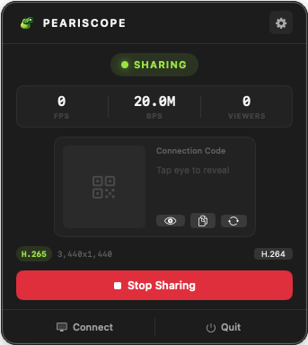
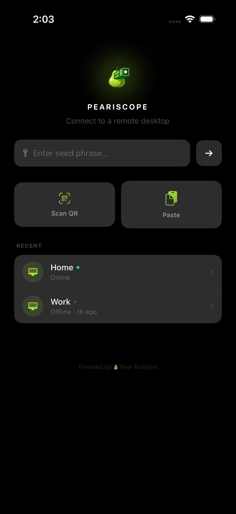

<div align="center">

# 🍐 Peariscope

**Peer-to-peer remote desktop — no servers, no accounts, no nonsense.**

Share your screen and control remote devices over fully encrypted P2P connections.

[](#platforms)

<br>


&nbsp;&nbsp;&nbsp;&nbsp;


</div>

<br>

## How it works

> **Host** starts sharing → gets a **12-word code** + **QR code** → **Viewer** enters code or scans QR → devices find each other via P2P → **PIN verification** → screen streams with full input control.

Everything runs over [Hyperswarm](https://github.com/holepunchto/hyperswarm) and the [Pear](https://docs.pears.com) runtime — a distributed hash table for peer discovery. No relay servers, no cloud, no accounts. Connections are end-to-end encrypted.

| | |
|---|---|
| 🖥️ **Video** | H.264/H.265 with adaptive quality |
| 🔊 **Audio** | AAC 48kHz stereo streaming |
| ⌨️ **Input** | Keyboard, mouse, and touch forwarded to host |
| 📋 **Clipboard** | Text and images sync automatically |
| 🔒 **Security** | End-to-end encrypted + PIN verification + Hyperswarm firewall |

<br>

## Platforms

| Platform | Role | Status |
|:---------|:-----|:------:|
| macOS | Host + Viewer | ✅ |
| Windows | Host + Viewer | ✅ |
| Linux | Host + Viewer | ✅ |
| iOS | Viewer | ✅ |
| Android | Host + Viewer | ✅ |

<br>

## Getting started

### Hosting

1. Open Peariscope and press **Start Hosting**
2. A **12-word connection code** and **QR code** appear — share either with the viewer
3. When a viewer connects, read the **PIN** to them over a trusted channel
4. The viewer enters the PIN and your desktop starts streaming

### Viewing (mobile)

1. Open Peariscope on your phone or tablet
2. **Scan the QR code** on the host's screen, or type the **12-word code** (autocomplete helps — just type the first few letters)
3. Tap **Connect**
4. Enter the **PIN** from the host
5. You're in — use touch gestures to navigate

### Viewing (desktop)

1. Open Peariscope and switch to **Viewer** mode
2. Enter the 12-word connection code and connect
3. Enter the PIN when prompted
4. Use your keyboard and mouse to control the remote desktop

<br>

## Architecture

### Pear v2 Integration

Peariscope is built on the [Pear](https://docs.pears.com) platform and uses **Pear v2** APIs:

- **Hyperswarm** for P2P peer discovery and encrypted connections
- **BareKit** embeds the Bare JS runtime in native iOS, macOS, and Android apps
- **Corestore + Hyperdrive** for DHT node persistence and OTA worklet updates
- **Pear lifecycle** — `Pear.teardown()` for clean shutdown when running via `pear run`
- **Import maps** — `node:*` modules mapped to Bare equivalents (`bare-fs`, `bare-os`, etc.)

The app can run two ways:
1. **Native app** (macOS/iOS/Android) — BareKit embeds the JS worklet in-process
2. **`pear run`** — Standalone terminal app via Pear CLI

### Two-Layer Update System

| Layer | Update mechanism |
|---|---|
| **JS worklet** (networking, IPC, rate limiting) | OTA via P2P Hyperdrive — no app reinstall needed |
| **Native shell** (UI, video codecs, Metal/MediaCodec) | macOS: Sparkle auto-update / iOS: TestFlight / Android: APK |

When a new worklet version is published to a Hyperdrive, all native apps detect it within seconds, download the bundle P2P, and apply it on next restart. The Connect screen shows download progress and update status.

### Networking Stack

```
┌─────────────────────────────────────────────────────┐
│  Native App (Swift / Kotlin)                        │
│  ┌───────────┐  ┌──────────┐  ┌──────────────────┐ │
│  │ Video     │  │ Input    │  │ Control (protobuf)│ │
│  │ H.264/265 │  │ Events   │  │ PIN, clipboard    │ │
│  └─────┬─────┘  └────┬─────┘  └────────┬─────────┘ │
│        └──────────────┼─────────────────┘           │
│                       │ IPC (4B len + 1B type)      │
│  ┌────────────────────┴─────────────────────────┐   │
│  │  BareWorkletBridge (Swift/Kotlin ↔ BareKit)  │   │
│  └────────────────────┬─────────────────────────┘   │
├───────────────────────┼─────────────────────────────┤
│  JS Worklet (Bare runtime)                          │
│  ┌────────────────────┴─────────────────────────┐   │
│  │  worklet.js — StreamMux, rate limiting, DHT  │   │
│  └────────────────────┬─────────────────────────┘   │
│                       │                             │
│  ┌────────────────────┴─────────────────────────┐   │
│  │  Hyperswarm — P2P connections over DHT       │   │
│  └──────────────────────────────────────────────┘   │
└─────────────────────────────────────────────────────┘
```

### Stream Channels

| Channel | Direction | Content |
|---------|-----------|---------|
| 0 | Host → Viewer | Video (Annex B H.264/H.265) |
| 1 | Viewer → Host | Input events |
| 2 | Bidirectional | Control messages (protobuf) |
| 3 | Host → Viewer | Audio (AAC 48kHz stereo) |
| 4 | Bidirectional | DHT node exchange |

### Connection Codes

12-word [BIP39](https://github.com/bitcoin/bips/blob/master/bip-0039.mediawiki) phrases with 132 bits of entropy. The DHT topic is derived via `blake2b-256("peariscope:" + normalized_words)` so both host and viewer resolve to the same Hyperswarm topic without a central server.

### DHT Node Discovery and Sharing

Peariscope maintains a self-healing mesh of DHT bootstrap nodes across all devices:

1. **Seed nodes** — Hardcoded list of known-good DHT nodes on non-standard ports, bypassing CGNAT and ISP blocks on the default Hyperswarm port (49737)
2. **Local sidecar** — If a Pear/Keet process is already running locally, its DHT node is used for instant bootstrap
3. **Native cache** — After each session, the worklet sends its DHT routing table to the native app for persistence (UserDefaults on Apple, SharedPreferences on Android). On next launch, these cached nodes are sent back to the worklet before Hyperswarm connects, dramatically reducing bootstrap time
4. **Peer exchange** — When two devices connect, they share their DHT routing tables over stream channel 4. A phone on a mobile network accumulates diverse nodes that a desktop behind CGNAT may not have, and vice versa. New nodes are merged into both the live DHT and the native cache
5. **Relay fallback** — When hole-punching fails (symmetric NAT, double CGNAT), Hyperswarm automatically relays the connection through a random DHT node. The relay selection prioritizes nodes on non-standard ports since those are more likely to be reachable

This means every connection makes future connections faster and more reliable — devices that have talked to many peers become better at finding new ones.
