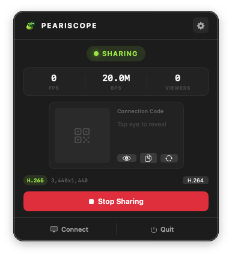
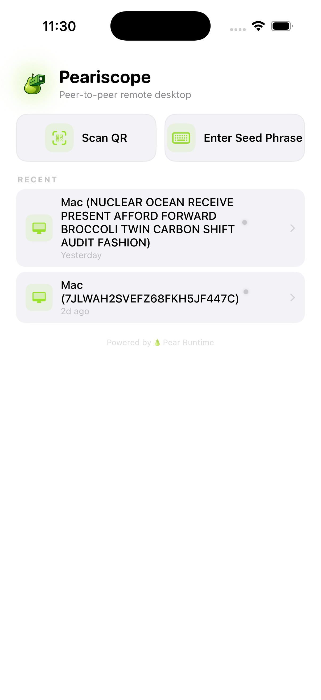

# Peariscope

Peer-to-peer remote desktop for macOS, iOS, and Windows. Share your screen and control remote devices over encrypted P2P connections — no servers, no accounts.


<p align="center">
  
  &nbsp;&nbsp;
  
</p>

## How it works

- **Host** shares their screen and generates a 12-word connection code (BIP39)
- **Viewer** enters the code (or scans a QR) to connect
- Devices find each other via [Hyperswarm](https://github.com/holepunchto/hyperswarm) DHT — fully peer-to-peer
- Video is encoded as H.264/H.265, streamed over encrypted channels
- Keyboard, mouse, and clipboard are forwarded to the host

## Platforms

| Platform | Role | Status |
|----------|------|--------|
| macOS | Host + Viewer | Working |
| iOS | Viewer | Working |
| Windows | Host + Viewer | In progress |

## Project structure

```
apple/                  # Xcode project (macOS + iOS)
  Sources/
    PeariscopeCore/     # Shared: networking, decoding, rendering
    PeariscopeMac/      # macOS app (host + viewer)
    PeariscopeIOS/      # iOS app (viewer)
  Resources/            # Assets, entitlements
pear/                   # JavaScript worklet (Hyperswarm networking)
  worklet.js            # Main worklet — bundled into apps via bare-pack
  package.json
protocol/               # Protobuf definitions
  messages.proto        # Control channel messages
windows/                # Windows C++ app
  src/
```

## Building

### Prerequisites

- Xcode 16+ (macOS/iOS)
- Node.js 18+ (for bundling the JS worklet)
- [Bare](https://github.com/nicola/bare) runtime tools: `npm install -g bare-pack`

### Bundle the JS worklet

The networking layer runs as a JavaScript worklet via BareKit. You must bundle it before building:

```bash
cd pear
npm install

# macOS bundle
npx bare-pack --preset darwin --linked --base . --out ./worklet.bundle ./worklet.js

# iOS bundle
npx bare-pack --preset ios --linked --base . --out ./worklet-ios.bundle ./worklet.js
```

> The `--linked` flag is critical — without it, native addons fail silently.

### macOS

```bash
cd apple
xcodebuild build -scheme PeariscopeMac -destination 'platform=macOS' -configuration Debug
```

### iOS

```bash
cd apple
xcodebuild build -scheme PeariscopeIOS -destination 'generic/platform=iOS' -configuration Release
```

### Windows

See `windows/` directory (work in progress).

## Architecture

- **Networking**: BareKit runs a JS worklet that uses Hyperswarm/HyperDHT for P2P discovery and encrypted streams
- **IPC Protocol**: Native ↔ Worklet communication via length-prefixed binary messages over bare-pipe
- **Stream Multiplexing**: Channel 0 = video (Annex B H.264/H.265), Channel 1 = input events, Channel 2 = control (protobuf)
- **Connection Codes**: BIP39 12-word mnemonic phrases. Topic derived via `crypto.data("peariscope:" + normalized_words)`
- **Video**: ScreenCaptureKit (macOS) → VideoToolbox H.264/H.265 encoding → P2P stream → VideoToolbox decoding → Metal rendering

## License

GPL v3 — see [LICENSE](LICENSE).
